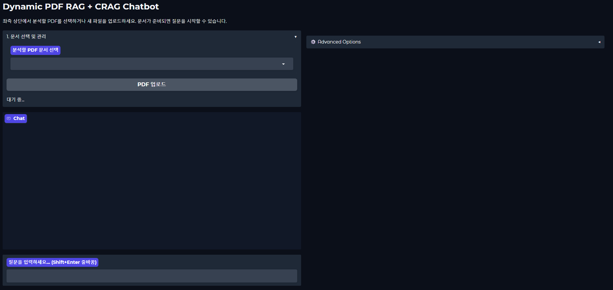
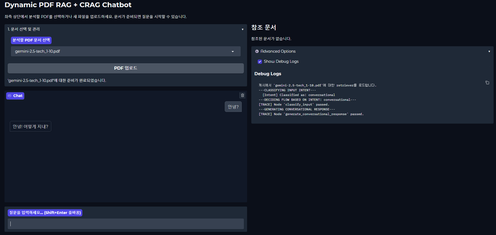
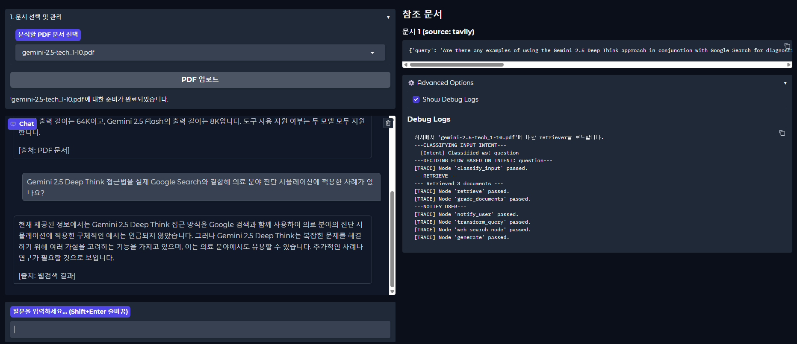
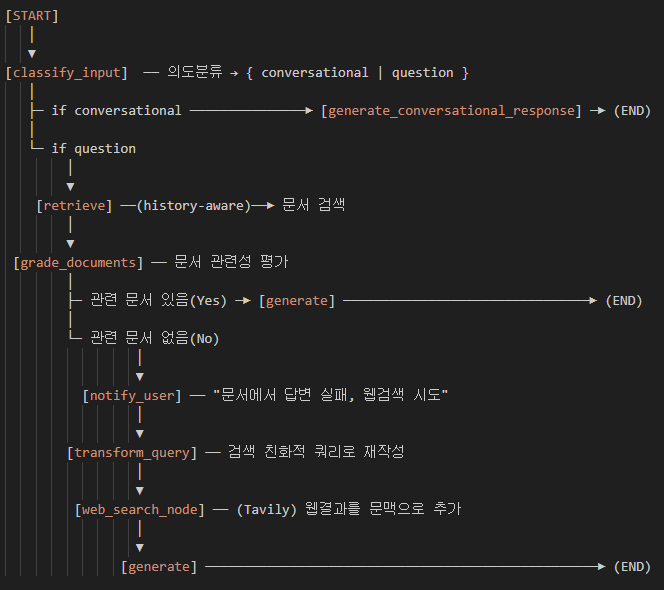

# CRAG 미니 프로젝트 고도화 보고서

## 1. RAG 프로젝트 고도화: CRAG 및 동적 UI 구현

LangGraph를 사용해 파이프라인을 재설계 했고, CRAG(Corrective RAG) 개념을 도입하여 보다 지능적인 질의 응답 시스템을 구축하여, 기존 RAG(Retrieval-Augmented Generation) 프로젝트의 아키텍처와 사용자 경험을 대폭 개선했습니다.

주요 개선 사항은 다음과 같습니다.

-   **동적 문서 처리 UI (Gradio):**
    -   하드코딩된 파일 경로를 제거하고, 사용자가 UI에서 직접 PDF를 선택하거나 업로드할 수 있도록 개선했습니다.
    -   선택된 문서를 기반으로 독립적인 데이터베이스와 저장소 경로(`chroma_db/문서명` 등)를 동적으로 생성하여, 여러 문서를 효율적으로 관리할 수 있는 기반을 마련했습니다.

-   **지능형 RAG 파이프라인 (LangGraph & CRAG):**
    -   **지능형 라우팅**: LangGraph를 도입하여, 사용자 입력을 '단순 대화'와 '정보성 질문'으로 먼저 분류합니다. 대화형 입력은 불필요한 검색 과정을 건너뛰고 즉시 답변을 생성하여 응답 속도와 효율성을 높였습니다.
    -   **품질 평가 (Corrective)**: 검색된 문서가 질문과 관련 없는 경우, LLM이 스스로 이를 판단하여 답변 생성에서 제외함으로써 환각(Hallucination) 현상을 억제합니다.
    -   **정보 보강 (Augmented)**: 관련 문서가 없다고 판단되면, 질문을 웹 검색에 적합하게 재작성한 뒤, 웹 검색을 통해 외부 정보를 탐색하여 답변을 생성합니다.

-   **핵심 로직 개선 (PDF 파서 교체):**
    -   `LlamaParse` 의존성을 제거하고, Gemini API를 직접 호출하여 PDF 텍스트와 테이블을 추출하는 `gemini_parser.py` 모듈을 구현했습니다. 이를 통해 더욱 성능좋은 아웃파서를 사용할 수 있습니다.

---

## 2. 학습 내용 정리: 심층 문제 해결 과정

이번 프로젝트 고도화 과정에서 겪었던 가장 큰 어려움은 **예상치 못한 API 오류를 해결하는 과정**이었습니다. 이 경험은 단순한 코딩을 넘어, 문제의 근본 원인을 추적하는 시스템적인 디버깅 능력을 기르는 데 큰 도움이 되었습니다.

### 2.1. 상황: 잘 작동하던 기능이 갑자기 오류를 일으키다

동일한 코드와 파일임에도 불구하고, 어느 순간부터 PDF 파일을 처리한 후 llm에게 보내려 할 때 `google.genai.errors.ClientError: 400 INVALID_ARGUMENT` 오류가 발생하기 시작했습니다.

### 2.2. 잘못된 가설과 막다른 길

문제 해결을 위해 API 변경, google-genai 버전충돌, 코드 수정 등 여러 가설을 세우고 검증했지만, 모두 근본적인 해결책이 아니었습니다.

### 2.3. 돌파구: 진짜 원인의 발견

코드와 API 설정의 미로에 갇혀있을 때, **진짜 원인은 바로 운영체제(OS) 수준의 "파일 연결(기본 프로그램)" 설정**이라는 결정적인 단서를 발견했습니다.

-   **문제**: 오류가 발생하던 PDF 파일의 기본 프로그램이 윈도우에서 **'한컴 PDF'**로 설정되어 있었습니다.
-   **메커니즘**: `google-generativeai` 라이브러리는 파일을 업로드할 때, OS의 파일 연결 설정을 참고하여 파일의 `mime_type`을 추론합니다. '한컴 PDF'와의 연결 때문에, 라이브러리는 이 파일의 `mime_type`을 표준적인 `application/pdf`가 아닌, 비표준적인 `mime_type`인 `application/haansoftpdf`으로 되어있었던 것 입니다.
-   **결과**: 잘못된 `mime_type` 정보와 함께 파일이 구글 서버로 업로드되었고, 모델이 이 파일을 처리하려 할 때, "처리할 수 없는 종류의 파일"이라 판단하여 `400 INVALID_ARGUMENT` 오류를 반환했던 것입니다.

### 2.4. 교훈: 시스템 전체를 보는 눈

이번 경험을 통해 **API 관련 오류의 근본 원인은 코드나 API 키 자체를 넘어, 코드가 실행되는 운영체제 환경이나 데이터 자체의 숨겨진 속성 등 예상치 못한 곳에 있을 수 있다**는 중요한 교훈을 얻었습니다. 오류 메시지에만 매몰되지 않고, 문제가 발생하는 상황과 그렇지 않은 상황의 **환경적 차이**를 집요하게 파고들어 근본 원인을 찾아낸 좋은 경험이었습니다.

---

## 3. 시스템 구현 및 실행 화면

아래는 프로젝트의 주요 기능 및 개발 과정을 담은 실행 화면입니다.

### 이미지 1: 메인 UI 화면

*Gradio로 구현된 챗봇의 메인 인터페이스입니다. 좌측 상단에서 PDF 문서를 선택하거나 업로드할 수 있으며, 중앙의 채팅창을 통해 질의응답을 수행합니다.*

### 이미지 2: Gemini PDF 파서 모듈 코드

*PDF의 텍스트와 테이블을 추출하기 위해 자체 제작한 `gemini_parser.py`의 코드 일부입니다. Gemini 2.5 Pro 모델을 직접 호출하여 파싱을 수행합니다.*

### 이미지 3: PDF 파싱 실행 로그

*`gemini_parser.py`가 실행될 때의 터미널 로그입니다. PDF 파일을 Gemini File API에 업로드하고, 콘텐츠를 생성한 후, 로컬에 마크다운 파일로 저장하는 과정을 보여줍니다.*

### 이미지 4: debug log 버튼

*터미널 뿐만 아니라 Gradio환경에서도 debug log를 볼 수 있도록 설정했습니다.*

### 이미지 5: debug log

*챗봇에게 query를 넣으면 output이 나오기까지 노드를 출력해줍니다.*

### 이미지 6: 터미널

*터미널 환경에서도 debug log가 출력되는 모습*

### 이미지 7: PDF 문서 내의 내용에 대한 query

*PDF 문서 내의 내용에 대한 query를 날렸을 때 PDF의 내용을 가져와 그 내용으로 답해주는 모습*

### 이미지 8: PDF 문서 외의 내용에 대한 query

*PDF 문서 외의 내용에 대한 query를 날리면 문서에 대한 답변을 찾지못해 인터넷 검색을 시도한다고 출력됨.*

### 이미지 9: 웹검색 결과

*웹검색 결과가 되는 모습.*
*debug log에는 grade_dobuments(pdf에서 문서 찾기)를 지나고 해당 내용에 대한 정보가 CRAG시스템에 의해 찾지 못함으로 인해 notify_user(사용자에게 인터넷 검색을 하겠다는 알림)을 주고 나서 query를 변경하고 web search를 하는 log가 출력된다.*

---

### 파이프라인

---

## 4. 결론

본 프로젝트를 통해 단순 RAG를 넘어 CRAG 아키텍처를 성공적으로 구현하였으며, 사용자 중심의 동적 UI를 통해 시스템의 사용성과 확장성을 크게 향상시켰습니다. 특히 예측 불가능한 오류를 시스템 전체의 관점에서 분석하고 해결하는 과정을 통해, 기술적 문제 해결 능력을 한 단계 발전시킬 수 있었습니다.

---

## 5. 완성 코드 제출

위의 모든 기능과 학습 내용이 반영된 최종 `CRAG.py` 및 `gemini_parser.py` 코드를 함께 제출합니다.